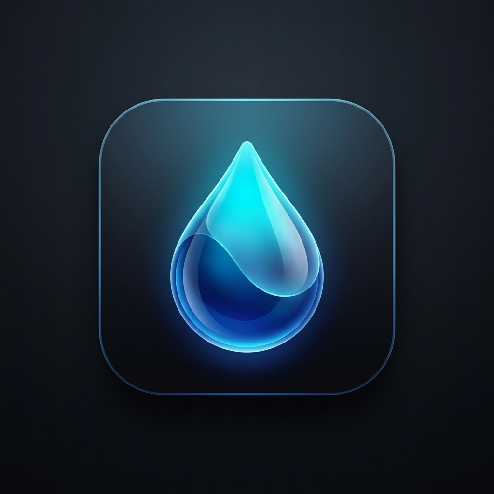

# BLUE — Water Quality Intelligence 🌊



[](https://bluex1.vercel.app/)
[](https://www.python.org/)
[](https://fastapi.tiangolo.com/)

**BLUE** is an advanced, multi-standard compliance and Water Quality Index (WQI) scoring engine. It analyzes water parameter data against strict global thresholds (e.g., BIS Drinking Water, WHO, FAO Agriculture) and provides real-time diagnostics, intelligent scoring, and detailed breakdown reports.

---

## ✨ Features

*   **Multi-Standard Evaluation:** Instantly switch between strictness profiles including Drinking, Agriculture, Industrial, and Aquaculture.
*   **BLUE AI Engine:** Describe your water sample naturally or paste raw lab readings; our intelligent engine extracts the parameters and runs the analysis.
*   **Batch CSV Processing:** Upload bulk datasets via a drag-and-drop interface for high-throughput compliance testing.
*   **Dynamic Bento Dashboard:** A stunning, highly responsive, glassmorphic UI built with a modern bento-box grid architecture and cinematic radial backgrounds.
*   **PDF Reporting:** Generate and download comprehensive water quality breakdown reports instantly.
*   **Robust Security:** Fully hardened backend with rate-limiting, strict CORS policies, and payload size constraints.

## 🚀 Live Demo
Experience the landing page here: **[bluex1.vercel.app](https://bluex1.vercel.app/)**

## 🏗️ Architecture

The project is decoupled into a lightning-fast API backend and a lightweight, dependency-free frontend client.

*   **Backend (`server.py`)**: A high-performance FastAPI application handling rate-limiting, request hardening, WQI calculation logic, and PDF generation.
*   **Frontend (`Main-page/`)**: Pure HTML, CSS (Custom Properties, CSS Grid, Glassmorphism), and Vanilla JavaScript (`app.js`). No heavy frameworks required.

## 🛠️ Getting Started

### Prerequisites
* Python 3.10+
* `pip`

### 1. Backend Setup

1. Clone the repository and navigate to the root directory.
2. Install the required Python dependencies (e.g., FastAPI, Uvicorn).
   ```bash
   pip install fastapi uvicorn python-multipart
   ```
3. Set your environment variables (optional). To override the default CORS policy for local development:
   ```bash
   # Windows (PowerShell)
   $env:ALLOWED_ORIGINS="http://127.0.0.1:5500"
   ```
4. Start the FastAPI server:
   ```bash
   uvicorn server:app --reload
   ```
   The backend will be live at `http://127.0.0.1:8000/`.

### 2. Frontend Setup

1. Open `Main-page/index.html`.
2. Ensure the API base URL meta tag points to your backend. By default, it points to local:
   ```html
   <meta name="blue-api-base" content="http://127.0.0.1:8000/">
   ```
   *(Note: Change this to your production API URL before deploying the frontend!)*
3. Serve the `Main-page/` directory using any static file server (e.g., VS Code Live Server).

## 🔒 Deployment

When preparing for production deployment:
1. Set the `ALLOWED_ORIGINS` environment variable on your backend host to explicitly allow your frontend domain (e.g., `https://bluex1.vercel.app`).
2. Update the `<meta name="blue-api-base">` tag in `index.html` to point to your live backend domain.
3. The frontend can be hosted statically on platforms like Vercel, Netlify, or GitHub Pages.
4. The backend can be deployed to platforms like Render, Railway, or AWS.

## 🎨 Typography & Design
BLUE features a meticulously crafted typography stack for maximum readability and visual hierarchy:
*   **Space Grotesk** (Branding & Logo)
*   **Clash Display** (Main Headings)
*   **Inter** (Body text)
*   **JetBrains Mono** (Scores & Tabular data)
*   **IBM Plex Mono** (Badges & Small labels)

## 📄 License
MIT License. Feel free to fork and build upon this!
